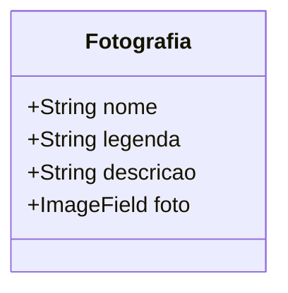

# Photo Gallery Project

## Descrição
🎨 Este projeto, **Photo Gallery**, é um sistema web de galeria de imagens desenvolvido com o framework **Django 5** e estilizado com **Bootstrap 5**. Ele foi criado como parte do **projeto de conclusão da matéria de WebDesign** do quarto semestre do curso técnico em Informática para Internet. O projeto é funcional e foi hospedado na nuvem utilizando serviços como **AWS EC2**, **RDS**, e **Nginx + Gunicorn** para configuração de servidor, além de implementar **certificado SSL** para garantir segurança nas conexões. 🌟✨📷

## Principais Funcionalidades
- **Sistema de Galeria** 📸:
  - Exibição de imagens dinâmicas com título, legenda e descrição.
  - Modal interativo para visualização de detalhes das fotografias.
  - Links para atualizar ou deletar cada fotografia diretamente do modal.
- **Upload de Imagens** 🚀:
  - Possibilidade de fazer upload de imagens via painel de administração do Django.
- **Estilização Responsiva** 📱:
  - Layout responsivo utilizando Bootstrap 5 para uma experiência amigável em diferentes dispositivos.
- **Infraestrutura na Nuvem** ☁️:
  - Hospedagem no **AWS EC2**.
  - Banco de dados **RDS (PostgreSQL)** para armazenamento de dados.
  - Configuração de servidor **Nginx + Gunicorn**.
  - Certificado **SSL** para conexões seguras via HTTPS. 🌟

## Tecnologias Utilizadas
- **Back-End** ⚙️:
  - Django 5
  - Python 3
- **Front-End** 🎨:
  - Bootstrap 5
  - JavaScript
- **Banco de Dados** 🗄️:
  - PostgreSQL (via AWS RDS)
- **Infraestrutura** 🌐:
  - AWS EC2
  - AWS RDS
  - Nginx + Gunicorn
  - Let's Encrypt (SSL) 🔧

## Arquitetura do Projeto
🎯 1. **Modelagem de Dados**:

🎯 2. **Frontend**:
   - As imagens são exibidas em um layout de galeria responsivo.
   - Ao clicar em uma imagem, um modal é aberto com as informações detalhadas da fotografia.

🎯 3. **Interatividade**:
   - O arquivo `main.js` faz requisições AJAX para buscar os detalhes das imagens e atualizá-los dinamicamente no modal.

### Exibição Dinâmica com Bootstrap e AJAX
Para a funcionalidade de modais dinâmicos com Bootstrap e integração de AJAX, a implementação foi feita com os seguintes passos:

1. **Estrutura HTML do Modal**:
   No template `fotografias_list.html`, adiciona-se o modal vazio que será preenchido dinamicamente:
   ```html
   <div class="modal fade" id="photoModal" tabindex="-1" aria-hidden="true">
       <div class="modal-dialog">
           <div class="modal-content">
               <div class="modal-header">
                   <h5 class="modal-title" id="photoTitle"></h5>
                   <button type="button" class="btn-close" data-bs-dismiss="modal" aria-label="Close"></button>
               </div>
               <div class="modal-body">
                   
                   <p id="photoDescription"></p>
                   <small id="photoLegend"></small>
               </div>
           </div>
       </div>
   </div>
   ```

2. **Função JavaScript com AJAX**:
   O arquivo `main.js` é responsável por capturar os eventos de clique e fazer a requisição AJAX:
   ```javascript
   document.addEventListener('DOMContentLoaded', function() {
       const modal = new bootstrap.Modal(document.getElementById('photoModal'));

       document.querySelectorAll('.photo-card').forEach(card => {
           card.addEventListener('click', function() {
               const photoId = this.dataset.id;
               fetch(`/fotografia/${photoId}/`)
                   .then(response => response.json())
                   .then(data => {
                       document.getElementById('photoTitle').innerText = data.nome;
                       document.getElementById('photoImage').src = data.foto_url;
                       document.getElementById('photoDescription').innerText = data.descricao;
                       document.getElementById('photoLegend').innerText = data.legenda;
                       modal.show();
                   });
           });
       });
   });
   ```

3. **Endpoint para Dados da Fotografia**:
   No `views.py`, foi implementada a função `fotografia_detail` para retornar as informações em JSON:
   ```python
   from django.http import JsonResponse
   from django.shortcuts import get_object_or_404
   from .models import Fotografia

   def fotografia_detail(request, pk):
       fotografia = get_object_or_404(Fotografia, pk=pk)
       data = {
           "nome": fotografia.nome,
           "legenda": fotografia.legenda,
           "descricao": fotografia.descricao,
           "foto_url": fotografia.foto.url if fotografia.foto else "",
       }
       return JsonResponse(data)
   ```

## Estrutura do Projeto
📁 **Estrutura de Diretórios**:
```bash
$ tree

project_root/
├── gallery/          # App principal
│   ├── apps.py       # Configurações do app Django
│   ├── models.py     # Modelos Django
│   ├── urls.py       # Rotas do app
│   ├── views.py      # Views para manipulação das fotografias
├── media/            # Diretório para uploads de imagens
├── manage.py         # Script de gerenciamento do Django
├── setup/            # Configurações do projeto
│   ├── settings.py   # Configurações gerais do Django
│   ├── urls.py       # Rotas principais
├── templates/    # Templates HTML

```

## Configurações de Hospedagem
🌐 1. **AWS EC2**:
   - Instância Linux configurada para hospedar a aplicação Django.
   - Configuração de grupo de segurança para permitir tráfego HTTP e HTTPS.

🌐 2. **Nginx + Gunicorn**:
   - Nginx utilizado como proxy reverso para o Gunicorn.
   - Configuração otimizada para alta performance.

🌐 3. **RDS (PostgreSQL)**:
   - Banco de dados relacional para armazenar informações das fotografias.

🌐 4. **Let's Encrypt**:
   - Certificado SSL gerado para conexões seguras (HTTPS).

## Como Rodar o Projeto Localmente
⚙️ 1. **Clone o repositório**:
   ```bash
   git clone https://github.com/FernandoAurelius/photo-gallery
   cd django-gallery
   ```

⚙️ 2. **Crie um ambiente virtual**:
   ```bash
   python3 -m venv venv
   source venv/bin/activate  # No Windows: venv\Scripts\activate
   ```

⚙️ 3. **Instale as dependências**:
   ```bash
   pip install -r requirements.txt
   ```

⚙️ 4. **Aplique as migrações**:
   ```bash
   python manage.py migrate
   ```

⚙️ 5. **Inicie o servidor local**:
   ```bash
   python manage.py runserver
   ```

⚙️ 6. **Acesse o projeto**:
   Abra o navegador e acesse: `http://127.0.0.1:8000` 🌍✨

## Screenshots
- **Galeria de Imagens**:
  
  

- **Modal de Detalhes**:
  

## Aprendizados e Desafios
📘 **Aprendizados**:
  - Configuração completa de um servidor com Nginx e Gunicorn.
  - Implementação de segurança com SSL e configuração de infraestrutura na AWS.

📘 **Desafios**:
  - Configurar e integrar os serviços da AWS.
  - Garantir que o projeto fosse responsivo e funcional em diferentes dispositivos.

## Autor
Projeto desenvolvido por FernandoAurelius, estudante do curso técnico em Informática para Internet do CEMI. ✨

---
📩 Qualquer dúvida ou sugestão, fique à vontade para abrir uma issue no repositório ou entrar em contato! 🌟

